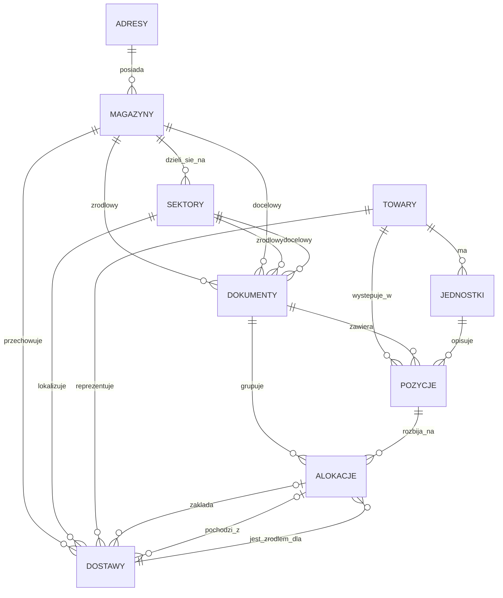
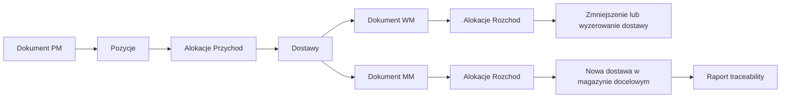
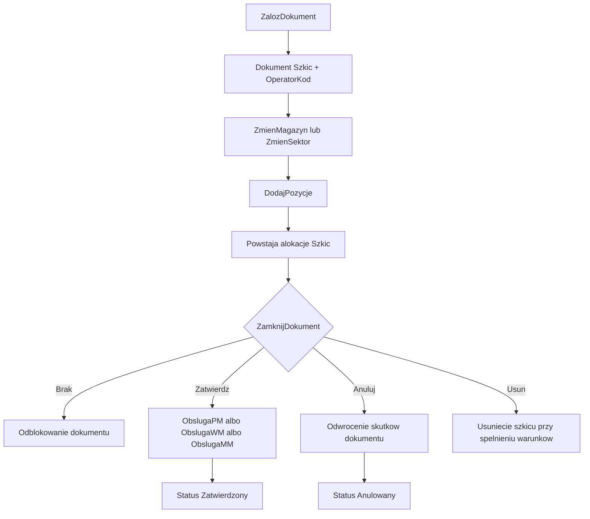

# SQL WMS - dokumentacja systemu bazodanowego

## 1. Cel systemu

System implementuje magazynowy model pracy oparty o dokumenty PM, WM i MM.

- `PM` reprezentuje przyjecie towaru do magazynu.
- `WM` reprezentuje wydanie towaru z magazynu.
- `MM` reprezentuje przesuniecie miedzymagazynowe.

Model danych laczy trzy perspektywy:

- ewidencje struktury fizycznej: adresy, magazyny i sektory,
- kartoteke towarowa: towary i ich jednostki,
- obsluge przeplywu zapasu: dokumenty, pozycje, alokacje i dostawy.

W praktyce system nie zmienia stanu magazynowego bezposrednio na poziomie dokumentu. Najpierw powstaje szkic dokumentu, potem pozycje i alokacje, a dopiero zatwierdzenie uruchamia logike biznesowa zapisujaca lub konsumujaca rekordy `SBD.Dostawy`.

## 2. Zakres repozytorium

Repozytorium zawiera komplet obiektow SQL potrzebnych do postawienia i zasilenia bazy:

- `Schemat.sql` - tworzy schemat `SBD`.
- `Tabele/*.sql` - definicje tabel i czesc zmian ewolucyjnych `ALTER TABLE`.
- `Funkcje/*.sql` - funkcje pomocnicze wykorzystywane przez logike proceduralna i triggery.
- `Triggery/*.sql` - walidacje integralnosci, ktorych nie da sie wygodnie zamknac samym constraintem.
- `Widoki/*.sql` - widoki raportowo-aplikacyjne upraszczajace odczyt danych.
- `Procedury/**/*.sql` - operacje biznesowe i CRUD.
- `Skrypty/inicjalizacja.sql` - skrypt zasilajacy dane slownikowe i demo, mimo nazwy nie jest to pelna inicjalizacja schematu.
- `RunZasilajacy.sql` - scenariusz ruchow magazynowych do wypelnienia systemu dokumentami i dostawami.
- `PrzykladowyRun.sql` - prosty skrypt do recznych testow obiegu dokumentow.

## 3. Zalecana kolejnosc uruchomienia

1. `Schemat.sql`
2. wszystkie pliki z katalogu `Tabele`
3. wszystkie pliki z katalogu `Funkcje`
4. wszystkie pliki z katalogu `Widoki`
5. wszystkie pliki z katalogu `Triggery`
6. wszystkie pliki z katalogu `Procedury`
7. `Skrypty/inicjalizacja.sql`
8. opcjonalnie `RunZasilajacy.sql` albo `PrzykladowyRun.sql`

## 4. Model domenowy

### 4.1. Najwazniejsze encje

| Encja | Rola w systemie |
| --- | --- |
| `SBD.Adresy` | slownik adresow przypisywanych magazynom |
| `SBD.Magazyny` | fizyczne lokalizacje magazynowe |
| `SBD.Sektory` | strefy wewnatrz magazynu |
| `SBD.Towary` | kartoteka towarow |
| `SBD.Jednostki` | jednostki miary przypisane do towaru i przeliczniki na jednostke bazowa |
| `SBD.Dokumenty` | naglowki dokumentow PM, WM, MM |
| `SBD.Pozycje` | pozycje dokumentow z towarem, jednostka i iloscia |
| `SBD.Alokacje` | rozbicie pozycji na cechy i kierunki przeplywu |
| `SBD.Dostawy` | fizyczny zapis partii zapasu w konkretnej lokalizacji |

### 4.2. Diagram relacji encji

### 4.3. Diagram przeplywu zapasu

## 5. Kluczowe zasady modelu

### 5.1. Dokument jest glowna jednostka biznesowa

- naglowek przechowuje typ dokumentu, status, serie, operatora i lokalizacje zrodlowe/docelowe,
- dokument jest edytowany tylko wtedy, gdy `OperatorKod` wskazuje aktywnego operatora,
- `ZalozDokument` od razu ustawia blokade na operatora zakladajacego dokument,
- `OtworzDokument` pozwala ponownie przejac blokade,
- `ZamknijDokument` zwalnia blokade albo wykonuje akcje biznesowa `Brak`, `Zatwierdz`, `Anuluj`, `Usun`.

### 5.2. Ilosci sa przechowywane w jednostce bazowej

- `SBD.Jednostki.Przelicznik` definiuje przeliczenie na jednostke bazowa,
- `SBD.Pozycje.Ilosc` i `SBD.Alokacje.Ilosc` sa zapisywane juz po przeliczeniu,
- interfejs i widoki moga prezentowac ilosc handlowa, ale w bazie ilosc jest znormalizowana.

### 5.3. Alokacja nie jest jeszcze ruchem magazynowym

- szkic pozycji tworzy alokacje z `Kierunek = 'Szkic'`,
- dopiero obslugi dokumentow zmieniaja alokacje na `Przychod` albo `Rozchod`,
- `WM` i `MM` konsumuje istniejace dostawy,
- `PM` i czesc docelowa `MM` zakladaja nowe dostawy.

### 5.4. Dostawa jest rekordem fizycznej partii zapasu

- wskazuje towar, magazyn, sektor, ceche i aktualna ilosc,
- moze byc powiazana z alokacja, ktora ja zalozyla,
- moze wskazywac alokacje zrodlowa, z ktorej powstala w wyniku przesuniecia,
- dzieki temu mozna odtworzyc pelna historie przeplywu partii.

## 6. Opis tabel

### 6.1. `SBD.Adresy`

Rola: slownik adresow dla magazynow.

- klucz glowny: `Id`,
- wazne kolumny: `Kraj`, `KodKraju`, `Wojewodztwo`, `Powiat`, `Gmina`, `Miejscowosc`, `KodPocztowy`, `Poczta`, `Ulica`, `NumerDomu`, `NumerLokalu`,
- kolumna wyliczana: `AdresPelny`,
- metadane: `DataUtworzenia`, `DataModyfikacji`,
- relacje: tabela nadrzedna dla `SBD.Magazyny`.

### 6.2. `SBD.Magazyny`

Rola: fizyczne magazyny lub obszary pracy.

- klucz glowny: `Id`,
- klucz obcy: `AdresId -> SBD.Adresy(Id)`,
- wazne kolumny: `Kod`, `Nazwa`, `Opis`,
- ograniczenia: unikalny `Kod`,
- relacje: rodzic dla `SBD.Sektory`, referencja dla dokumentow i dostaw.

### 6.3. `SBD.Sektory`

Rola: strefy wewnatrz magazynu.

- klucz glowny: `Id`,
- klucz obcy: `MagazynId -> SBD.Magazyny(Id)`,
- wazne kolumny: `Kod`, `Nazwa`, `Opis`,
- ograniczenia: `Kod` jest unikalny globalnie,
- uwaga projektowa: nazwa constraintu sugeruje scope magazynu, ale sama definicja to `UNIQUE (Kod)`.

### 6.4. `SBD.Towary`

Rola: kartoteka towarow.

- klucz glowny: `Id`,
- wazne kolumny: `Kod`, `Nazwa`, `Opis`, `KodKreskowy`,
- ograniczenia: unikalny `Kod`,
- relacje: rodzic dla `SBD.Jednostki`, referencja dla `SBD.Pozycje` i `SBD.Dostawy`.

### 6.5. `SBD.Jednostki`

Rola: jednostki miary przypisane do konkretnego towaru.

- klucz glowny: `Id`,
- klucz obcy: `TowarId -> SBD.Towary(Id)`,
- wazne kolumny: `Kod`, `Nazwa`, `Przelicznik`,
- ograniczenia: `Przelicznik > 0`, unikalnosc `(TowarId, Kod)`,
- regula biznesowa: dla jednego towaru dokladnie jedna jednostka bazowa powinna miec `Przelicznik = 1`,
- ta regula jest pilnowana triggerem, a nie constraintem tabelarycznym.

### 6.6. `SBD.Dokumenty`

Rola: naglowki dokumentow magazynowych.

- klucz glowny: `Id`,
- wazne kolumny: `Numer`, `TypDokumentu`, `DataDokumentu`, `Opis`, `Status`, `Seria`, `OperatorKod`,
- kolumny wyliczane: `RokDokumentu`, `MiesiacDokumentu`, `NumerDokumentu`, `NumerDokumentuSort`,
- lokalizacje: `MagazynZrodlowy*`, `SektorZrodlowy*`, `MagazynDocelowy*`, `SektorDocelowy*`,
- ograniczenia: `TypDokumentu in ('PM','WM','MM')`, `Status in ('Szkic','Zatwierdzony','Anulowany')`, unikalnosc `(TypDokumentu, Numer, RokDokumentu, MiesiacDokumentu, Seria)`,
- relacje: rodzic dla `SBD.Pozycje` i `SBD.Alokacje`.

### 6.7. `SBD.Pozycje`

Rola: pozycje dokumentu.

- klucz glowny: `Id`,
- klucze obce: `DokumentId`, `TowarId`, `JednostkaId`,
- wazne kolumny: `TowarKod`, `TowarNazwa`, `JednostkaKod`, `JednostkaPrzelicznik`, `Ilosc`,
- dane towaru i jednostki sa denormalizowane do celow audytowych i wygodnego odczytu,
- `Ilosc` jest trzymana po przeliczeniu na jednostke bazowa,
- ograniczenia: `Ilosc > 0`, `JednostkaPrzelicznik > 0` lub `NULL`.

### 6.8. `SBD.Alokacje`

Rola: szczegolowy rozklad pozycji dokumentu.

- klucz glowny: `Id`,
- klucze obce: `DokumentId`, `PozycjaId`, `DostawaId`,
- wazne kolumny: `Kierunek`, `Ilosc`, `Cecha`, `DataUtworzenia`,
- stan poczatkowy: domyslnie `Kierunek = 'Szkic'`,
- dozwolone wartosci `Kierunek`: `Szkic`, `Przychod`, `Rozchod`,
- ewolucja schematu: plik zawiera starsza definicje constraintu i pozniejsza poprawke przez `ALTER TABLE`,
- relacja do `Dostawy` oznacza albo zrodlo rozchodu, albo dostawe zalozona dla przychodu.

### 6.9. `SBD.Dostawy`

Rola: fizyczny zapis aktualnego zapasu i jego pochodzenia.

- klucz glowny: `Id`,
- klucze obce: `TowarId`, `MagazynId`, `SektorId`, `ZakladajacaPozycjaId`, `ZakladajacaAlokacjaId`, `ZrodlowaAlokacjaId`,
- wazne kolumny: `TowarKod`, `TowarNazwa`, `Ilosc`, `Cecha`,
- ograniczenia: `Ilosc >= 0`,
- `ZakladajacaAlokacjaId` wskazuje alokacje, ktora stworzyla dostawe,
- `ZrodlowaAlokacjaId` wskazuje alokacje rozchodowa, z ktorej dana dostawa powstala,
- to wlasnie na tej tabeli opiera sie traceability.

## 7. Widoki

| Widok | Cel | Zrodla danych | Najwazniejsze informacje |
| --- | --- | --- | --- |
| `SBD.DokumentyView` | lista dokumentow do aplikacji | glownie `SBD.Dokumenty` | teksty pomocnicze dla magazynow i sektorow, status, numer sortowalny |
| `SBD.PozycjeView` | odczyt pozycji w postaci przyjaznej dla UI | `SBD.Pozycje`, `SBD.Dokumenty` | `IloscJednostkowa`, numer dokumentu, typ dokumentu |
| `SBD.AlokacjeView` | podglad alokacji z informacja o dokumencie zrodlowym | `SBD.Alokacje`, `SBD.Dostawy`, `SBD.Alokacje`, `SBD.Pozycje`, `SBD.Dokumenty` | ilosc jednostkowa, cecha, kierunek, zrodlowy numer dokumentu |
| `SBD.MagazynyView` | lista magazynow z adresem i liczba sektorow | `SBD.Magazyny`, `SBD.Adresy`, `SBD.Sektory` | `AdresPelny`, liczba sektorow |
| `SBD.SektoryView` | lista sektorow z magazynem | `SBD.Sektory`, `SBD.Magazyny` | kody i nazwy sektora oraz magazynu |
| `SBD.TowaryView` | stan towarow w przekroju po cesze | `SBD.Towary`, agregacja `SBD.Dostawy` | aktualna ilosc wg towaru i cechy |

### 7.1. Uwagi do widokow

- `SBD.TowaryView` moze zwracac wiele wierszy dla tego samego towaru, jesli towar wystepuje w wielu cechach,
- `SBD.AlokacjeView` jest kluczowy do prezentacji pochodzenia alokacji i dziala jak lekki most do traceability,
- `SBD.DokumentyView` sluzy bardziej do odczytu i prezentacji niz do logiki transakcyjnej.

## 8. Funkcje

| Funkcja | Zwraca | Znaczenie |
| --- | --- | --- |
| `SBD.DajKluczOdpiecia()` | `ODEPNIJ` | specjalny klucz pozwalajacy zdjac sektor z dokumentu |
| `SBD.DajKluczPustejCechy()` | `Brak` | techniczny znacznik pustej cechy przy scalaniu lub edycji alokacji |

## 9. Triggery

| Trigger | Tabela | Cel | Regula |
| --- | --- | --- | --- |
| `SBD.WalidacjaKoduSektora` | `SBD.Sektory` | blokada zarezerwowanego kodu | kod sektora nie moze byc rowny `SBD.DajKluczOdpiecia()` |
| `SBD.WalidacjaJednostkiPodstawowejTowaru` | `SBD.Jednostki` | pilnowanie jednostki bazowej | dla jednego towaru nie moze istniec wiecej niz jedna jednostka z `Przelicznik = 1` |

## 10. Procedury

### 10.1. Procedury dokumentow

| Procedura | Rola | Kluczowe parametry | Najwazniejsze reguly i efekty |
| --- | --- | --- | --- |
| `SBD.ZalozDokument` | zaklada nowy dokument | `@TypDokumentu`, `@DataWystawienia`, `@Seria`, `@Operator` | wylicza kolejny numer w miesiacu, roku i serii, tworzy szkic, od razu ustawia `OperatorKod` |
| `SBD.OtworzDokument` | przejmuje blokade dokumentu | `@Id`, `@Operator` | pozwala otworzyc dokument, jesli nikt inny go nie blokuje |
| `SBD.WalidacjaBlokady` | waliduje mozliwosc modyfikacji | `@DokumentId`, `@Operator` | dokument musi istniec, byc otwarty przez wskazanego operatora i nie moze byc zatwierdzony lub anulowany |
| `SBD.EdytujDokument` | edycja naglowka | `@Id`, `@DataDokumentu`, `@Opis`, `@Operator` | zmienia tylko dane naglowkowe, nie zmienia typu dokumentu ani numeracji |
| `SBD.ListaDokumentow` | wyszukiwanie i stronicowanie | parametry strony, sortowania i filtrowania | dynamiczne SQL, filtr po numerze, dacie, typie, serii, magazynach, sektorach, towarze |
| `SBD.ZmienMagazyn` | ustawia magazyn zrodlowy albo docelowy | `@Id`, `@Magazyn`, `@Typ`, `@Operator` | PM nie moze ustawic magazynu zrodlowego, WM nie moze ustawic docelowego, zmiana magazynu czysci sektor po tej stronie |
| `SBD.ZmienSektor` | ustawia sektor zrodlowy albo docelowy | `@Id`, `@Sektor`, `@Typ`, `@Operator` | obsluguje wartosc `ODEPNIJ`, pilnuje zgodnosci z magazynem i zakazu wskazania tego samego sektora po obu stronach |
| `SBD.ZamknijDokument` | zamyka dokument i wykonuje akcje biznesowa | `@Id`, `@Akcja`, `@Operator` | obsluguje `Brak`, `Zatwierdz`, `Anuluj`, `Usun`; nie usuwa dokumentow zatwierdzonych ani anulowanych; deleguje do `ObslugaPM`, `ObslugaWM`, `ObslugaMM` |

### 10.2. Procedury pozycji

| Procedura | Rola | Kluczowe parametry | Najwazniejsze reguly i efekty |
| --- | --- | --- | --- |
| `SBD.DodajPozycje` | dodanie pozycji do dokumentu | `@TowarKod`, `@DokumentId`, `@Ilosc`, `@Jednostka`, `@Cecha`, `@Operator` | zapisuje pozycje i tworzy poczatkowa alokacje `Szkic`; ilosc jest przeliczana na jednostke bazowa |
| `SBD.EdytujPozycje` | zmiana ilosci pozycji | `@Id`, `@Ilosc`, `@Operator` | przelicza ilosc na jednostke bazowa i dopasowuje powiazane alokacje |
| `SBD.UsunPozycje` | usuniecie pozycji | `@Id`, `@Operator` | usuwa pozycje i wszystkie jej alokacje |

### 10.3. Procedury alokacji

| Procedura | Rola | Kluczowe parametry | Najwazniejsze reguly i efekty |
| --- | --- | --- | --- |
| `SBD.RozbijAlokacje` | rozbicie alokacji na dwie czesci | `@Id`, `@Ilosc`, `@Cecha`, `@Operator` | dzieli ilosc i opcjonalnie nadaje nowa ceche nowemu rekordowi |
| `SBD.UsunAlokacje` | usuniecie jednej alokacji | `@Id`, `@Operator` | pozycja musi zachowac co najmniej jedna alokacje; ilosc jest scalana do innej alokacji albo przepinana na pusta ceche |

### 10.4. Procedury obslugi dokumentow

| Procedura | Typ dokumentu | Zatwierdzenie | Anulowanie |
| --- | --- | --- | --- |
| `SBD.ObslugaPM` | PM | tworzy dostawy i zamienia alokacje na `Przychod`; jesli sektor docelowy jest pusty, wybiera najmniej zapelniony sektor w magazynie docelowym | zeruje dostawy utworzone przez dokument, o ile nie zostaly przesuniete dalej |
| `SBD.ObslugaWM` | WM | konsumuje dostawy z magazynu zrodlowego i tworzy alokacje `Rozchod` | przywraca ilosci na dostawach |
| `SBD.ObslugaMM` | MM | konsumuje dostawy zrodlowe, tworzy alokacje `Rozchod` i `Przychod`, zaklada nowe dostawy docelowe, a przy pustym sektorze wybiera najmniej zapelniony sektor | przywraca stan zrodlowy i zeruje dostawy utworzone po stronie docelowej |

### 10.5. Procedury adresow, magazynow, sektorow, jednostek i towarow

W repozytorium znajduja sie nastepujace pliki proceduralne:

- `SBD.DodajAdres`
- `SBD.EdytujAdres`
- `SBD.UsunAdres`
- `SBD.DodajMagazyn`
- `SBD.EdytujMagazyn`
- `SBD.UsunMagazyn`
- `SBD.DodajSektor`
- `SBD.EdytujSektor`
- `SBD.UsunSektor`
- `SBD.DodajJednostke`
- `SBD.UsunJednostke`
- `SBD.DodajTowar`
- `SBD.EdytujTowar`
- `SBD.UsunTowar`

Obecnie sa to pliki przygotowane jako miejsca pod implementacje. Z punktu widzenia dokumentacji warto zaznaczyc, ze w aktualnym stanie systemu glowna logika biznesowa zostala zaimplementowana dla obiegu dokumentow, pozycji, alokacji i traceability, a nie dla proceduralnego CRUD danych slownikowych.

### 10.6. Procedura raportowa

| Procedura | Cel | Parametry | Opis |
| --- | --- | --- | --- |
| `SBD.RaportTraceability` | odtworzenie historii przeplywu partii | `@DokumentNumer`, `@TowarKod`, `@Cecha` | wykorzystuje rekurencyjne CTE do sledzenia przejsc od dokumentu przychodowego przez kolejne rozchody i nowe dostawy |

## 11. Cykl zycia dokumentu

### 11.1. Reguly workflow

- dokument moze byc modyfikowany tylko przez operatora, ktory posiada blokade,
- `WalidacjaBlokady` jest wywolywana przez procedury modyfikujace,
- `PM` wymaga magazynu docelowego,
- `WM` wymaga magazynu zrodlowego,
- `MM` wymaga obu stron,
- zmiana magazynu zeruje przypisany sektor po tej samej stronie,
- dokumentu zatwierdzonego albo anulowanego nie da sie dalej edytowac ani usunac,
- dokument typu szkic nie rezerwuje fizycznego zapasu; realny ruch zachodzi dopiero przy zatwierdzeniu.

## 12. Traceability

### 12.1. Co sledzi raport

`SBD.RaportTraceability` zaczyna od dokumentu wskazanego po `NumerDokumentu` i wyszukuje dostawy zalozone przez alokacje przychodowe tego dokumentu. Nastepnie:

- odnajduje rozchody konsumujace te dostawy,
- szuka nowych dostaw, ktore powstaly z tych rozchodow,
- buduje tekstowa sciezke przejsc,
- zwraca rowniez terminalne wydania, po ktorych nie powstaje juz nowa dostawa.

W praktyce raport odpowiada na pytanie: `dokad trafila dana partia towaru po przyjeciu i przez jakie dokumenty przeszla po drodze?`

### 12.2. Diagram logiki traceability

### 12.3. Wazne szczegoly implementacyjne

- raport korzysta z rekurencyjnego CTE i `OPTION (MAXRECURSION 100)`,
- filtr opcjonalny pozwala zawezic wynik po `TowarKod` i `Cecha`,
- anulowane dokumenty sa pomijane w dalszym sledzeniu,
- raport naturalnie najlepiej startuje od dokumentu, ktory zalozyl dostawy, czyli od `PM` albo przychodowej strony `MM`.

## 13. Dane demonstracyjne i scenariusze

### 13.1. `Skrypty/inicjalizacja.sql`

Skrypt przygotowuje demo dla duzej piekarni rzemieslniczo-produkcyjnej. Wprowadza miedzy innymi:

- dwa adresy,
- kilka magazynow, na przyklad hala pieca, magazyn pieczywa, chlodnia, hala ekspedycji i sklepik,
- rozbudowany zestaw sektorow odpowiadajacych realnym strefom pracy,
- towary i jednostki pomocnicze typu `taca`, `wozek`, `kosz`.

### 13.2. `RunZasilajacy.sql`

Skrypt odtwarza rzeczywiste scenariusze pracy:

- zakladanie dokumentow PM,
- ustawianie magazynow i sektorow,
- dodawanie pozycji z cechami,
- zatwierdzanie dokumentow, przez co powstaja rekordy `SBD.Dostawy`,
- budowanie danych do testowania pozniejszych przesuniec i raportu traceability.

### 13.3. `PrzykladowyRun.sql`

Jest to prosty zestaw komend do manualnego sprawdzenia:

- zalozenia dokumentu,
- dodania pozycji,
- rozbicia alokacji,
- usuniecia pozycji,
- podejrzenia tabel po kazdym kroku.

## 14. Mocne strony projektu

- spojny model obiegu dokumentowego,
- wyrazne rozdzielenie szkicu od faktycznego ruchu magazynowego,
- logiczny podzial na dostawy, alokacje i pozycje,
- mozliwosc sledzenia pochodzenia partii przez `RaportTraceability`,
- warstwa widokow upraszczajaca integracje z aplikacja WPF.

## 15. Ograniczenia i rzeczy warte jawnego opisania

- CRUD dla danych slownikowych istnieje w strukturze katalogow, ale nie jest jeszcze zaimplementowany proceduralnie,
- `Sektory.Kod` jest unikalne globalnie, a nie w ramach magazynu,
- brak rezerwacji zapasu na etapie szkicu dokumentu,
- `Cecha` jest wartoscia swobodnie wpisywana, bez osobnej tabeli slownikowej,
- w `SBD.Alokacje.sql` widac ewolucje schematu: starsza definicje `Kierunek` i pozniejsza poprawke przez `ALTER TABLE`,
- `Skrypty/inicjalizacja.sql` ma nazwe sugerujaca instalacje, ale faktycznie pelni role seedera danych,
- cala historia zmian zapasu opiera sie na semantyce `Dostawy`, `ZakladajacaAlokacjaId` i `ZrodlowaAlokacjaId`, wiec te pola sa krytyczne dla poprawnosci traceability.

## 16. Podsumowanie architektury

Najkrocej: system buduje silny model dokumentowy, w ktorym:

- slowniki definiuja przestrzen i kartoteke,
- dokumenty sa punktem wejscia dla operacji,
- pozycje i alokacje rozbijaja intencje biznesowa na konkretne partie,
- dostawy przechowuja faktyczny stan magazynowy,
- traceability odtwarza historie przeplywu partii po relacjach miedzy alokacjami i dostawami.

Jest to sensowny projekt WMS o architekturze skoncentrowanej na dokumentach, z wyraznym naciskiem na audytowalnosc ruchow i sledzenie pochodzenia towaru.
